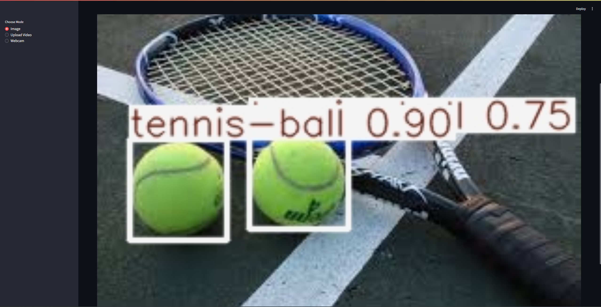
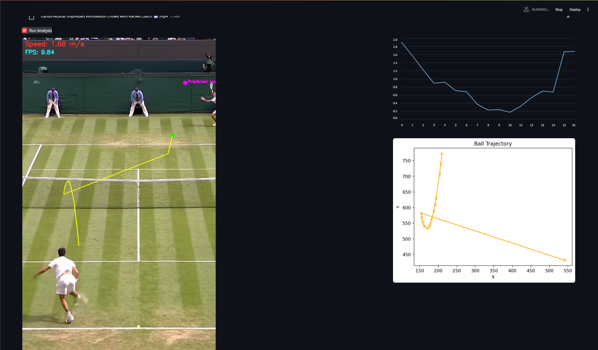

# Tennis Paul Beta-1

Tennis Paul Beta-1 is a computer vision app that uses YOLOv8 and OpenCV to detect and analyze the trajectory and motion of tennis balls in various media inputs (images, videos, webcam). The interface is built with Streamlit for interactivity and visualization.


## Features

* **Image Upload Mode**: Detects tennis balls in static images.
* **Video Upload Mode**: Tracks ball movement, estimates speed, plots trajectory and predicts landing position.
* **Webcam Mode**: Real-time tracking and analysis (hardware dependent).
* **Trajectory Plotting**: Visualizes past positions of the tennis ball using OpenCV polylines and Matplotlib.
* **Speed Estimation**: Calculates approximate ball speed based on frame-to-frame position changes.
* **Landing Prediction**: Estimates where the ball will land by linear extrapolation.

## Demos

### Image Test and Video Test Side by Side

<table>
  <tr>
    <td></td>
    <td></td>
  </tr>
  <tr>
    <td align="center">Image Test</td>
    <td align="center">Video Test</td>
  </tr>
</table>


## How It Works

### 1. YOLOv8 Detection

* Uses a custom-trained `paul.pt` YOLOv8 model.
* Model inference gives bounding boxes.
* First detected bounding box is taken as the tennis ball.

### 2. Trajectory Tracking

* Maintains a deque of recent ball center positions.
* Draws trajectory line on the frame.

### 3. Speed Estimation

* Uses pixel distance between frames:

```
dx = (x2 - x1) / ppm
dy = (y2 - y1) / ppm
distance = sqrt(dx^2 + dy^2)
speed = distance / dt
```

* Assumes 80 pixels per meter (adjustable).

### 4. Landing Point Prediction

* Estimates next landing point from last two positions:

```
dx = x2 - x1
dy = y2 - y1
landing = (x2 + dx * 3, y2 + dy * 3)
```

* Draws marker on frame with a timeout to fade prediction.

### 5. Visualization

* FPS and ball speed shown on video.
* Matplotlib graph of ball path and Streamlit line chart of speed are displayed side-by-side.

## Model Training

The YOLOv8 model was trained using the [Ultralytics](https://github.com/ultralytics/ultralytics) framework.

| Dataset Type     | Epochs | Description                    |
| ---------------- | ------ | ------------------------------ |
| Stationary Balls | 30     | Clean images of isolated balls |
| Tennis Matches   | 50     | Match footage with motion blur |

The model is capable of detecting tennis balls in both static and dynamic scenes.

## Requirements

* Python 3.8+
* OpenCV
* Streamlit
* PIL
* Matplotlib
* Ultralytics YOLOv8

Install dependencies:

```bash
pip install -r requirements.txt
```

## Run the App

```bash
streamlit run app.py
```

Make sure the `paul.pt` model file is in the correct location.

## File Structure

```
.
├── app.py            # Streamlit application
├── paul.pt           # YOLOv8 trained weights
├── requirements.txt  # Dependency list
├── images/           # Screenshots and result visualizations
```

## Limitations & Future Work

* Only one ball is tracked per frame (first detection).
* No physics-based bounce simulation.
* Webcam support is device-dependent and may be unstable.
* Pixels-per-meter is a fixed guess (80), not calibrated.

Planned improvements:

* Add configurable camera calibration.
* Incorporate velocity vector smoothing.
* Use projectile motion to simulate bounce and decay.
* Add confidence score annotations on detections.
